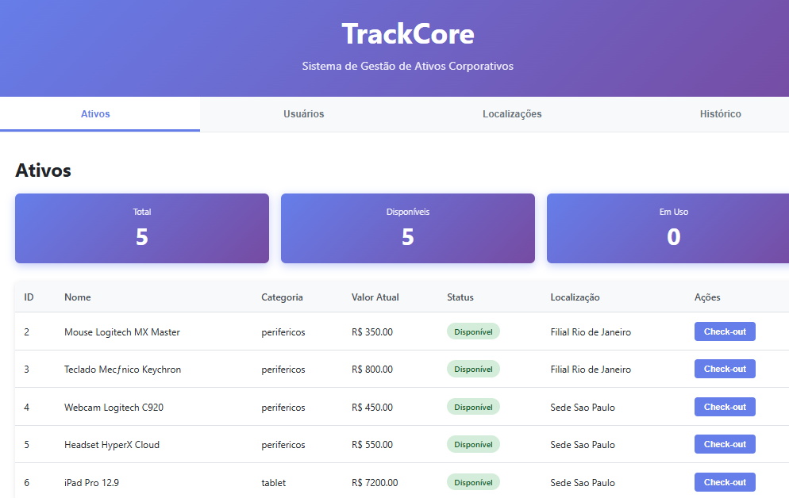

# TrackCore

Sistema SaaS de Gestão de Ativos Corporativos e Rastreabilidade Patrimonial.

## Screenshots




---

## Português

### Sobre o Projeto

Sistema completo de gestão de ativos corporativos com rastreabilidade total. Controla o ciclo de vida dos ativos desde a aquisição até a baixa, com histórico de custódia, cálculo automático de depreciação e importação de notas fiscais.

### Funcionalidades

- API REST completa com CRUD de ativos, usuários e localizações
- Sistema de Check-in e Check-out para atribuição e devolução de ativos
- Rastreabilidade completa via histórico de custódia
- Cálculo automático de depreciação por categoria de ativo
- Importação em massa de notas fiscais via CSV
- Registro de auditoria completo de todas as alterações
- Interface web responsiva para visualização e gestão

### Stack Tecnológica

**Backend:** Java 21, Spring Boot 3.5.10, Spring Data JPA  
**Frontend:** HTML5, CSS3, JavaScript  
**Scripts de Automação:** Python 3.13, Pandas, Psycopg2  
**Banco de Dados:** PostgreSQL 16  
**Infraestrutura:** Docker, Docker Compose

### Regras de Negócio

- Um ativo só pode estar com um usuário por vez
- Quando um ativo é transferido, o registro antigo recebe a data de fim automaticamente
- Todo ativo começa com status "disponível"
- Depreciação é calculada automaticamente via script Python com taxas específicas por categoria:
  - Notebooks: 20% ao ano
  - Monitores: 10% ao ano
  - Celulares: 25% ao ano
  - Impressoras: 15% ao ano
  - Servidores: 20% ao ano
- Toda alteração no sistema gera um registro no audit log

### Arquitetura
```
Frontend (HTML/CSS/JS)
         ↓
Application Layer (Spring Boot Controllers)
         ↓
Business Layer (Services)
         ↓
Persistence Layer (JPA Repositories)
         ↓
Database Layer (PostgreSQL)
         ↓
Automation Layer (Python Scripts)
```

### Executar Localmente

**Pré-requisitos:** Docker Desktop, Git, Python 3.x
```bash
git clone https://github.com/JazzGEO/TrackCore.git
cd TrackCore
docker-compose up -d
```

**Acessar:**

- API: http://localhost:8080/api/assets
- Frontend: Abrir `frontend/index.html` no navegador

**Rodar Scripts Python:**
```bash
cd scripts-python
python -m venv venv
venv\Scripts\activate
pip install psycopg2-binary pandas openpyxl python-decouple
python calculate_depreciation.py
python import_invoices.py example_invoice.csv
```

### Estrutura do Projeto
```
TrackCore/
├── backend-java/
│   ├── src/main/
│   │   ├── java/com/trackcore/backend/
│   │   │   ├── controller/
│   │   │   ├── entity/
│   │   │   ├── repository/
│   │   │   ├── service/
│   │   │   └── TrackCoreBackendApplication.java
│   │   └── resources/
│   │       └── application.properties
│   ├── Dockerfile
│   └── pom.xml
├── frontend/
│   ├── index.html
│   ├── style.css
│   └── app.js
├── scripts-python/
│   ├── calculate_depreciation.py
│   ├── import_invoices.py
│   ├── example_invoice.csv
│   └── .env
├── database/
│   ├── create_tables.sql
│   ├── insert_test_data.sql
│   └── MODELAGEM.md
├── docker-compose.yml
└── README.md
```

### API

**Assets**
- `GET /api/assets` - Listar todos os ativos
- `GET /api/assets/{id}` - Buscar ativo por ID
- `GET /api/assets/status/{status}` - Buscar por status
- `GET /api/assets/category/{category}` - Buscar por categoria
- `GET /api/assets/available` - Listar ativos disponíveis
- `POST /api/assets` - Criar ativo
- `PUT /api/assets/{id}` - Atualizar ativo
- `POST /api/assets/{id}/checkout` - Atribuir ativo
- `POST /api/assets/{id}/checkin` - Devolver ativo
- `DELETE /api/assets/{id}` - Deletar ativo

**Users**
- `GET /api/users` - Listar todos os usuários
- `GET /api/users/{id}` - Buscar usuário por ID
- `POST /api/users` - Criar usuário
- `PUT /api/users/{id}` - Atualizar usuário
- `DELETE /api/users/{id}` - Deletar usuário

**Locations**
- `GET /api/locations` - Listar todas as localizações
- `POST /api/locations` - Criar localização

**Custody History**
- `GET /api/custody-history/asset/{assetId}` - Histórico de um ativo
- `GET /api/custody-history/user/{userId}` - Histórico de um usuário

### Decisões Técnicas

PostgreSQL foi escolhido pela integridade referencial e suporte nativo a JSONB para o audit log. Spring Boot foi usado por ser o framework mais maduro e utilizado no ecossistema Java. Python foi usado para automação por sua facilidade com processamento de dados. Docker foi usado para garantir que o ambiente de desenvolvimento seja consistente.

---

## English

### About

Complete corporate asset management SaaS system with full traceability. Controls the asset lifecycle from acquisition to disposal, with custody history, automatic depreciation calculation, and invoice importing.

### Features

- Complete REST API with CRUD operations for assets, users, and locations
- Check-in and Check-out system for asset assignment and return
- Complete traceability via custody history
- Automatic depreciation calculation by asset category
- Bulk invoice importing via CSV
- Full audit log of all system changes
- Responsive web interface for visualization and management

### Tech Stack

**Backend:** Java 21, Spring Boot 3.5.10, Spring Data JPA  
**Frontend:** HTML5, CSS3, JavaScript  
**Automation Scripts:** Python 3.13, Pandas, Psycopg2  
**Database:** PostgreSQL 16  
**Infrastructure:** Docker, Docker Compose

### Business Rules

- An asset can only be assigned to one user at a time
- When an asset is transferred, the previous record automatically receives an end date
- All assets start with "available" status
- Depreciation is calculated automatically via Python script with specific rates per category:
  - Notebooks: 20% per year
  - Monitors: 10% per year
  - Phones: 25% per year
  - Printers: 15% per year
  - Servers: 20% per year
- Every system change generates an audit log entry

### Architecture
```
Frontend (HTML/CSS/JS)
         ↓
Application Layer (Spring Boot Controllers)
         ↓
Business Layer (Services)
         ↓
Persistence Layer (JPA Repositories)
         ↓
Database Layer (PostgreSQL)
         ↓
Automation Layer (Python Scripts)
```

### Run Locally

**Prerequisites:** Docker Desktop, Git, Python 3.x
```bash
git clone https://github.com/JazzGEO/TrackCore.git
cd TrackCore
docker-compose up -d
```

**Access:**

- API: http://localhost:8080/api/assets
- Frontend: Open `frontend/index.html` in browser

**Run Python Scripts:**
```bash
cd scripts-python
python -m venv venv
venv\Scripts\activate
pip install psycopg2-binary pandas openpyxl python-decouple
python calculate_depreciation.py
python import_invoices.py example_invoice.csv
```

### Project Structure
```
TrackCore/
├── backend-java/
│   ├── src/main/
│   │   ├── java/com/trackcore/backend/
│   │   │   ├── controller/
│   │   │   ├── entity/
│   │   │   ├── repository/
│   │   │   ├── service/
│   │   │   └── TrackCoreBackendApplication.java
│   │   └── resources/
│   │       └── application.properties
│   ├── Dockerfile
│   └── pom.xml
├── frontend/
│   ├── index.html
│   ├── style.css
│   └── app.js
├── scripts-python/
│   ├── calculate_depreciation.py
│   ├── import_invoices.py
│   ├── example_invoice.csv
│   └── .env
├── database/
│   ├── create_tables.sql
│   ├── insert_test_data.sql
│   └── MODELAGEM.md
├── docker-compose.yml
└── README.md
```

### API

**Assets**
- `GET /api/assets` - List all assets
- `GET /api/assets/{id}` - Get asset by ID
- `GET /api/assets/status/{status}` - Get by status
- `GET /api/assets/category/{category}` - Get by category
- `GET /api/assets/available` - List available assets
- `POST /api/assets` - Create asset
- `PUT /api/assets/{id}` - Update asset
- `POST /api/assets/{id}/checkout` - Assign asset to user
- `POST /api/assets/{id}/checkin` - Return asset
- `DELETE /api/assets/{id}` - Delete asset

**Users**
- `GET /api/users` - List all users
- `GET /api/users/{id}` - Get user by ID
- `POST /api/users` - Create user
- `PUT /api/users/{id}` - Update user
- `DELETE /api/users/{id}` - Delete user

**Locations**
- `GET /api/locations` - List all locations
- `POST /api/locations` - Create location

**Custody History**
- `GET /api/custody-history/asset/{assetId}` - Get asset history
- `GET /api/custody-history/user/{userId}` - Get user history

### Technical Decisions

PostgreSQL was chosen for its referential integrity and native JSONB support for the audit log. Spring Boot was selected as it is the most mature and widely used framework in the Java ecosystem. Python was used for automation due to its ease of use with data processing. Docker was used to ensure consistency across development environments.
